# 🎨 Agri Volunteer - Design Document

## Document Information
- **Project**: Agri Volunteer Platform
- **Version**: 1.0.0
- **Last Updated**: February 15, 2026
- **Status**: In Development

---

## 📋 Table of Contents

1. [Design Philosophy](#design-philosophy)
2. [System Architecture](#system-architecture)
3. [Data Flow Diagrams](#data-flow-diagrams)
4. [Database Design](#database-design)
5. [Component Architecture](#component-architecture)
6. [UI/UX Design](#uiux-design)
7. [Security Architecture](#security-architecture)
8. [Deployment Architecture](#deployment-architecture)
9. [Integration Patterns](#integration-patterns)

---

## 1. Design Philosophy

### 1.1 Core Principles

```mermaid
graph TB
    subgraph "Design Principles"
        P1["🎯 Simplicity<br/>Zero friction for farmers"]
        P2["🌍 Accessibility<br/>Works on any phone"]
        P3["🤝 Community-First<br/>Local volunteers earn income"]
        P4["⚡ Performance<br/>Under 10 second response"]
        P5["🔒 Trust<br/>Transparent, reliable results"]
    end
    
    P1 --> UX["UX Design"]
    P2 --> TECH["Technology Choices"]
    P3 --> ECON["Economic Model"]
    P4 --> ARCH["Architecture"]
    P5 --> SEC["Security"]
```



### 1.2 User-Centric Design


---

## 2. System Architecture

### 2.1 High-Level Architecture

```mermaid
flowchart TB
    subgraph "Users"
        F["👨‍🌾 Farmer<br/>(WhatsApp)"]
        V["🤝 Volunteer<br/>(Mobile/Web)"]
        A["👨‍💼 Admin<br/>(Dashboard)"]
    end
    
    subgraph "Interface Layer"
        WA["WhatsApp Bot<br/>AiSensy/Interakt"]
        WEB["Next.js Web App<br/>Volunteer Dashboard"]
        ADMIN["Admin Panel<br/>Analytics & Management"]
    end
    
    subgraph "Application Layer"
        API["Next.js API Routes<br/>Business Logic"]
        ML["FastAPI ML Service<br/>Python + TensorFlow"]
        WEBHOOK["Webhook Handlers<br/>WhatsApp, IoT"]
    end
    
    subgraph "Data Layer"
        DB["(Supabase PostgreSQL)<br/>Primary Database"]
        STORAGE["(Supabase Storage)<br/>Images & Files"]
        CACHE["(Redis)<br/>Session & Cache"]
        RT["(Supabase Realtime)<br/>Live Updates"]
    end
    
    subgraph "ML Models"
        PEST["🐛 Pest Detection<br/>MobileNetV2<br/>91.2% accuracy"]
        SOIL["🌱 Soil Analysis<br/>XGBoost<br/>98.7% accuracy"]
    end
    
    subgraph "External APIs"
        AG["Agmarknet API<br/>Mandi Prices"]
        OW["OpenWeather API<br/>Weather Data"]
        PAY["Payment Gateway<br/>UPI/Paytm/Bank"]
    end
    
    F --> WA
    V --> WEB
    A --> ADMIN
    
    WA --> WEBHOOK
    WEB --> API
    ADMIN --> API
    
    API --> DB
    API --> STORAGE
    API --> CACHE
    API --> RT
    
    WEBHOOK --> API
    API --> ML
    
    ML --> PEST
    ML --> SOIL
    
    API --> AG
    API --> OW
    API --> PAY
    
    style F fill:#16a34a,color:#fff
    style V fill:#f59e0b,color:#fff
    style A fill:#6366f1,color:#fff
    style DB fill:#3ECF8E,color:#fff
    style PEST fill:#3b82f6,color:#fff
    style SOIL fill:#10b981,color:#fff
```



### 2.2 Microservices Architecture


### 2.3 Layered Architecture


---

## 3. Data Flow Diagrams

### 3.1 Farmer Disease Detection Flow

```mermaid
sequenceDiagram
    autonumber
    actor F as 👨‍🌾 Farmer
    participant WA as WhatsApp
    participant WH as Webhook Handler
    participant S3 as Image Storage
    participant ML as ML Service
    participant DB as Database
    participant PROD as Product Lookup
    participant SMS as SMS/WhatsApp

    F->>WA: Sends crop photo
    WA->>WH: POST webhook with media_id
    activate WH
    
    WH->>WH: Validate phone number
    WH->>WH: Get or create farmer record
    
    WH->>WA: GET image by media_id
    WA-->>WH: Return image binary
    
    WH->>S3: Upload image
    S3-->>WH: Return public URL
    
    WH->>ML: POST /predict/pest {image_url}
    activate ML
    ML->>ML: Preprocess: resize 224x224
    ML->>ML: Normalize pixel values
    ML->>ML: MobileNetV2 inference
    ML-->>WH: {disease, confidence, fixes}
    deactivate ML
    
    WH->>DB: Save scan record
    
    WH->>PROD: Get products for disease
    PROD-->>WH: Product recommendations
    
    WH->>SMS: Send diagnosis message
    SMS-->>F: "Your tomato has Late Blight (94% confidence)..."
    
    WH->>SMS: Send product list
    SMS-->>F: "Recommended: Copper Fungicide ₹180..."
    
    WH->>SMS: Send rating request
    SMS-->>F: "Rate this scan: ⭐⭐⭐⭐⭐"
    
    deactivate WH
    
    Note over F,SMS: Total time: 6-10 seconds
```



### 3.2 Volunteer Scanning & Coin Flow

```mermaid
sequenceDiagram
    autonumber
    actor V as 🤝 Volunteer
    participant APP as Mobile App
    participant API as API Gateway
    participant SCAN as Scan Service
    participant COIN as Coin Service
    participant DB as Database
    participant F as 👨‍🌾 Farmer

    V->>APP: Opens app, navigates to farm
    APP->>API: GET /api/farmer/{id}
    API->>DB: Fetch farmer details
    DB-->>API: Return farmer data
    API-->>APP: Display farmer info
    
    V->>APP: Takes crop photos
    APP->>API: POST /api/scan/upload
    API->>SCAN: Process images
    SCAN->>API: Return scan results
    
    alt Scan Successful
        API->>COIN: Award coins (10 coins)
        COIN->>DB: Create transaction
        COIN->>DB: Update volunteer balance
        COIN-->>API: Transaction confirmed
        API-->>APP: Show success + coins earned
        APP-->>V: "+10 coins earned!"
        
        API->>DB: Save scan record
        API->>F: Send results via WhatsApp
    else Scan Failed
        API-->>APP: Return error
        APP-->>V: Show error message
    end
    
    V->>APP: Views dashboard
    APP->>API: GET /api/volunteer/stats
    API->>DB: Fetch stats
    DB-->>API: Return stats
    API-->>APP: Display updated stats
    APP-->>V: Shows: Total coins, scans, rank
```



### 3.3 IoT Soil Sensor Flow


### 3.4 Coin Redemption Flow


---

## 4. Database Design

### 4.1 Entity Relationship Diagram


### 4.2 Database Schema Diagram


---

## 5. Component Architecture

### 5.1 Frontend Component Hierarchy


### 5.2 Backend API Structure


---

## 6. UI/UX Design

### 6.1 Design System


### 6.2 Page Wireframes - Dashboard

```mermaid
graph TB
    subgraph "Dashboard Layout"
        direction LR
        
        SIDEBAR["Sidebar (260px)<br/>┌─────────────────┐<br/>│ 🤝 Logo         │<br/>│ ─────────────── │<br/>│ 👤 User Profile │<br/>│ ─────────────── │<br/>│ 📊 Dashboard    │<br/>│ 🏆 Leaderboard  │<br/>│ 📸 My Scans     │<br/>│ 💰 Redeem       │<br/>│ ⚙️ Settings     │<br/>│ ─────────────── │<br/>│ 💰 Coin Widget  │<br/>│ ─────────────── │<br/>│ 🚪 Logout       │<br/>└─────────────────┘"]
        
        MAIN["Main Content Area<br/>┌─────────────────────────────────────┐<br/>│ Welcome back! 👋         [Logout] │<br/>├─────────────────────────────────────┤<br/>│ ┌──────┐ ┌──────┐ ┌──────┐ ┌──────┐ │<br/>│ │Coins │ │Scans │ │ Rank │ │Rating│ │<br/>│ │ 1,240│ │  112 │ │  #8  │ │ 4.7★ │ │<br/>│ └──────┘ └──────┘ └──────┘ └──────┘ │<br/>├─────────────────────────────────────┤<br/>│ Recent Scans          │ Coin Mile  │<br/>│ ┌───────────────────┐ │ ┌────────┐ │<br/>│ │ 🟢 Drone          │ │ │ 1,240  │ │<br/>│ │ Patna, Bihar      │ │ │ ██████░│ │<br/>│ │ +80 coins ⭐⭐⭐⭐⭐ │ │ │ 260 more│ │
│ └───────────────────┘ │ └────────┘ │<br/>├─────────────────────────────────────┤<br/>│ Quick Actions                       │<br/>│ [📱 New Scan] [🚁 Drone] [💸 Redeem]│<br/>└─────────────────────────────────────┘"]
    end
    
    SIDEBAR --> MAIN
```



---

## 7. Security Architecture

### 7.1 Security Layers


### 7.2 Authentication Flow


---

## 8. Deployment Architecture

### 8.1 Production Deployment


### 8.2 CI/CD Pipeline


---

## 9. Integration Patterns

### 9.1 Event-Driven Architecture


### 9.2 API Gateway Pattern

```mermaid
flowchart LR
    subgraph "Clients"
        C1["WhatsApp Bot"]
        C2["Web Dashboard"]
        C3["Mobile Browser"]
    end
    
    subgraph "API Gateway"
        GW["Gateway<br/>Next.js Middleware"]
        AUTH["Auth Filter"]
        RATE["Rate Limiter"]
        ROUTE["Router"]
    end
    
    subgraph "Microservices"
        S1["User Service"]
        S2["Scan Service"]
        S3["Coin Service"]
        S4["ML Service"]
    end
    
    C1 --> GW
    C2 --> GW
    C3 --> GW
    
    GW --> AUTH
    AUTH --> RATE
    RATE --> ROUTE
    
    ROUTE --> S1
    ROUTE --> S2
    ROUTE --> S3
    ROUTE --> S4
```

---

## 10. Performance & Scaling

### 10.1 Caching Strategy

```mermaid
flowchart TB
    subgraph "Cache Layers"
        L1["Browser Cache<br/>Static Assets"]
        L2["CDN Cache<br/>Vercel Edge"]
        L3["API Cache<br/>Redis"]
        L4["Database Cache<br/>Supabase Pool"]
    end
    
    subgraph "Cache Policies"
        P1["Static Assets<br/>1 year TTL"]
        P2["API Responses<br/>5 min TTL"]
        P3["User Sessions<br/>24 hour TTL"]
        P4["Leaderboard<br/>1 min TTL"]
    end
    
    L1 --> P1
    L2 --> P1
    L3 --> P2
    L3 --> P3
    L3 --> P4
    L4 --> P2
```

### 10.2 Auto-Scaling Configuration

```mermaid
graph TB
    subgraph "Metrics"
        M1["CPU Usage"]
        M2["Memory Usage"]
        M3["Request Queue"]
        M4["Response Time"]
    end
    
    subgraph "Triggers"
        T1["> 70% CPU"]
        T2["> 80% Memory"]
        T3["> 100 queued"]
        T4["> 2s response"]
    end
    
    subgraph "Actions"
        A1["Scale Up<br/>+2 instances"]
        A2["Scale Down<br/>-1 instance"]
        A3["Alert Team"]
    end
    
    M1 --> T1
    M2 --> T2
    M3 --> T3
    M4 --> T4
    
    T1 --> A1
    T2 --> A1
    T3 --> A1
    T4 --> A1
    
    T1 -.-> A3
    T4 -.-> A3
```

---

## 11. Monitoring & Observability

### 11.1 Observability Stack

```mermaid
graph TB
    subgraph "Application"
        A1["Next.js App"]
        A2["ML Service"]
        A3["Database"]
    end
    
    subgraph "Telemetry"
        T1["Logs<br/>Vercel + Winston"]
        T2["Metrics<br/>Vercel Analytics"]
        T3["Traces<br/>OpenTelemetry"]
    end
    
    subgraph "Monitoring Tools"
        M1["Dashboard<br/>Grafana"]
        M2["Alerts<br/>PagerDuty"]
        M3["Error Tracking<br/>Sentry"]
    end
    
    A1 --> T1
    A1 --> T2
    A2 --> T1
    A2 --> T2
    A3 --> T2
    
    T1 --> M3
    T2 --> M1
    T3 --> M1
    
    M1 --> M2
```

---

## 12. Appendix

### 12.1 Technology Stack Summary

| Layer | Technology | Purpose |
|-------|-----------|---------|
| **Frontend** | Next.js 14, TypeScript, Tailwind CSS | Web application |
| **Backend** | Next.js API Routes, Prisma | REST API |
| **ML Service** | FastAPI, Python, TensorFlow | AI inference |
| **Database** | Supabase PostgreSQL | Primary data store |
| **Storage** | Supabase Storage | File storage |
| **Cache** | Redis | Session & API caching |
| **Auth** | Supabase Auth | Authentication |
| **Deployment** | Vercel, Railway | Hosting |
| **Monitoring** | Vercel Analytics, Sentry | Observability |

### 12.2 API Versioning Strategy

```mermaid
graph LR
    V1["/api/v1/*<br/>Current Version"] --> S["Stable<br/>Supported"]
    V2["/api/v2/*<br/>Next Version"] --> D["Development<br/>Beta"]
    
    style V1 fill:#16a34a,color:#fff
    style V2 fill:#f59e0b,color:#fff
```

### 12.3 Backup & Disaster Recovery

```mermaid
flowchart TB
    subgraph "Primary"
        P[(Supabase<br/>Primary DB)]
    end
    
    subgraph "Backup Strategy"
        B1["Hourly<br/>Point-in-time"]
        B2["Daily<br/>Full Backup"]
        B3["Weekly<br/>Archive"]
    end
    
    subgraph "Recovery"
        R1["RPO: 1 hour"]
        R2["RTO: 4 hours"]
    end
    
    P --> B1
    P --> B2
    P --> B3
    
    B1 --> R1
    B2 --> R2
```

---

**Document Owner**: Agri Volunteer Development Team  
**Review Cycle**: Bi-weekly  
**Next Review Date**: 2026-03-01
