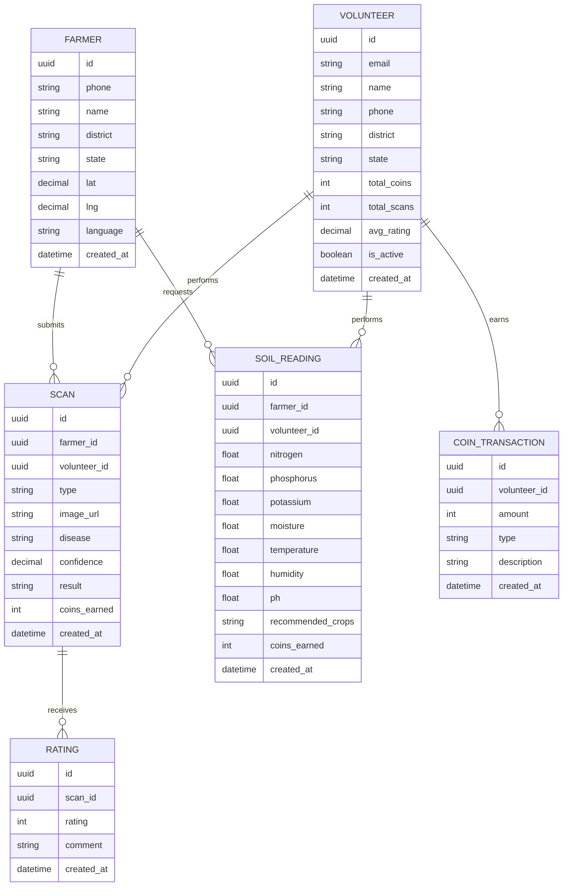

# 🌾 Agri Volunteer - Requirements Document

## Document Information
- **Project**: Agri Volunteer Platform
- **Version**: 1.0.0
- **Last Updated**: February 15, 2026
- **Status**: In Development

---

## 📋 Table of Contents

1. [Executive Summary](#executive-summary)
2. [Business Requirements](#business-requirements)
3. [User Requirements](#user-requirements)
4. [Functional Requirements](#functional-requirements)
5. [Non-Functional Requirements](#non-functional-requirements)
6. [System Requirements](#system-requirements)
7. [Data Requirements](#data-requirements)
8. [Security Requirements](#security-requirements)
9. [Integration Requirements](#integration-requirements)
10. [Performance Requirements](#performance-requirements)
11. [Constraints & Assumptions](#constraints--assumptions)

---

## 1. Executive Summary

### 1.1 Project Overview
Agri Volunteer is a comprehensive agricultural intelligence platform that connects farmers with local volunteers using AI/ML technology for:
- **Pest & Disease Detection**: 90%+ accuracy in under 10 seconds
- **Soil Health Analysis**: Real-time NPK monitoring and crop recommendations
- **Community-Powered Delivery**: Local volunteers earn income while helping neighbors

### 1.2 Problem Statement
India loses **₹92,000 crore annually** to crop diseases and soil degradation due to:
- Late disease detection (20-40% crop loss before diagnosis)
- No affordable real-time soil monitoring (₹36,000 crore lost annually)
- Technology barriers (430M farmers have basic phones, not smartphones)
- Last-mile gap between solutions and villages

### 1.3 Solution Goals
| Metric | Target |
|--------|--------|
| Farmers Helped (Year 1) | 10,000 |
| Active Volunteers | 1,000 across 20 states |
| Disease Detection Accuracy | >90% |
| Response Time | <10 seconds |

---

## 2. Business Requirements

### 2.1 Revenue Model
```
💰 Revenue Streams
├── Hardware Sales (35% margin)
│   └── ₹385 profit per ₹1,100 unit
├── SaaS Subscriptions
│   └── ₹50 lakh ARR target by Year 2
└── Break-even: Month 1 at 100 units/month
```

### 2.2 Business Rules
- **BR001**: Each volunteer earns 10 coins per completed scan
- **BR002**: 1 coin = ₹0.10 (₹1 = 10 coins)
- **BR003**: Minimum redemption: 500 coins (₹50)
- **BR004**: Volunteers rated 1-5 stars by farmers
- **BR005**: 5-star ratings earn bonus coins

### 2.3 Compliance Requirements
- **Data Privacy**: Compliant with IT Act 2000 and proposed Digital Personal Data Protection Bill
- **Agricultural Standards**: Follow ICAR guidelines for soil testing
- **Financial**: RBI guidelines for payment processing

---

## 3. User Requirements

### 3.1 User Personas

#### 3.1.1 Farmer (Primary User)
- **Demographics**: Rural India, basic education, feature phone or entry-level smartphone
- **Goals**: Quick crop diagnosis, affordable solutions, accessible in local language
- **Pain Points**: Distance to Krishi Kendra, lack of expert advice, delayed treatment
- **Tech Literacy**: Low to medium; comfortable with WhatsApp

#### 3.1.2 Volunteer (Secondary User)
- **Demographics**: Rural youth, college students, unemployed youth, age 18-35
- **Goals**: Earn supplementary income, help community, build skills
- **Pain Points**: Limited job opportunities, need for flexible income
- **Tech Literacy**: Medium to high; comfortable with smartphones and apps

#### 3.1.3 Administrator
- **Demographics**: Platform managers, agricultural experts
- **Goals**: Monitor system health, manage volunteer network, ensure quality
- **Pain Points**: Need for real-time insights, quality control
- **Tech Literacy**: High; comfortable with dashboards and analytics

### 3.2 User Stories

#### Farmer Stories
```gherkin
Feature: Crop Disease Detection

  Scenario: Farmer sends crop photo via WhatsApp
    Given a farmer has a WhatsApp-enabled phone
    When the farmer sends a crop photo to the WhatsApp bot
    Then the system should respond within 10 seconds with:
      | Disease name (in Hindi/English)    |
      | Confidence score                   |
      | Immediate treatment recommendation |
      | Long-term prevention tips          |
      | Product recommendations            |

  Scenario: Farmer requests soil analysis
    Given a farmer needs soil testing
    When the farmer requests a volunteer visit
    Then the system should:
      | Assign nearest available volunteer |
      | Schedule visit within 24 hours     |
      | Send NPK analysis results via SMS  |
      | Provide crop recommendations       |
```

#### Volunteer Stories
```gherkin
Feature: Volunteer Dashboard

  Scenario: Volunteer views earnings
    Given a volunteer is logged in
    When they access the dashboard
    Then they should see:
      | Total coins earned                 |
      | Number of scans completed          |
      | Current ranking (national/state)   |
      | Average farmer rating              |
      | Redemption options                 |

  Scenario: Volunteer redeems coins
    Given a volunteer has 500+ coins
    When they initiate redemption
    Then they should be able to:
      | Choose payment method (UPI/Paytm/Bank) |
      | Enter payment details                  |
      | Receive payment within 48 hours        |
```

---

## 4. Functional Requirements

### 4.1 Core Features

#### 4.1.1 WhatsApp Bot (FR-WA-001 to FR-WA-010)
| ID | Requirement | Priority | Acceptance Criteria |
|----|-------------|----------|---------------------|
| FR-WA-001 | Receive and process crop images | High | Accept JPEG/PNG up to 5MB, respond within 10 seconds |
| FR-WA-002 | Send disease diagnosis in Hindi | High | Include disease name, confidence, treatment in Hindi |
| FR-WA-003 | Send product recommendations | High | Show 3-5 relevant products with prices |
| FR-WA-004 | Handle voice input | Medium | Convert voice to text using Whisper API |
| FR-WA-005 | Multi-language support | Medium | Support Hindi, English, Marathi, Tamil, Telugu |
| FR-WA-006 | Market price queries | High | Return real-time mandi prices from Agmarknet API |
| FR-WA-007 | Rating collection | High | Send rating buttons (1-5 stars) after diagnosis |
| FR-WA-008 | Offline message queue | Medium | Queue messages when farmer is offline |
| FR-WA-009 | Broadcast alerts | Low | Send disease outbreak alerts to affected regions |
| FR-WA-010 | Soil test scheduling | High | Allow farmers to request volunteer visits |

#### 4.1.2 Volunteer Dashboard (FR-VD-001 to FR-VD-015)
| ID | Requirement | Priority | Acceptance Criteria |
|----|-------------|----------|---------------------|
| FR-VD-001 | User authentication | High | Email/password login with session management |
| FR-VD-002 | Dashboard home | High | Show stats: coins, scans, rank, rating |
| FR-VD-003 | Leaderboard view | High | National/state/district rankings, live updates |
| FR-VD-004 | Scan history | High | Filter by type, date, view detailed results |
| FR-VD-005 | Coin redemption | High | Minimum 500 coins, UPI/Paytm/Bank options |
| FR-VD-006 | Profile management | Medium | Update personal info, location, bio |
| FR-VD-007 | Notification settings | Medium | Toggle email/SMS preferences |
| FR-VD-008 | New scan reporting | Medium | Upload photos, add farmer details |
| FR-VD-009 | Drone scan scheduling | Low | Schedule and plan drone visits |
| FR-VD-010 | Earnings analytics | Medium | Weekly/monthly earnings charts |
| FR-VD-011 | Achievement badges | Low | Unlock badges for milestones |
| FR-VD-012 | Referral system | Low | Invite other volunteers, earn bonus |
| FR-VD-013 | Help & support | Medium | FAQ, contact support, report issues |
| FR-VD-014 | Mobile responsive | High | Fully functional on mobile browsers |
| FR-VD-015 | Dark mode | Low | Toggle between light/dark themes |

#### 4.1.3 Admin Panel (FR-AP-001 to FR-AP-010)
| ID | Requirement | Priority | Acceptance Criteria |
|----|-------------|----------|---------------------|
| FR-AP-001 | Volunteer management | High | View, approve, suspend volunteers |
| FR-AP-002 | Redemption approval | High | Review and approve coin redemptions |
| FR-AP-003 | Live statistics | High | Real-time dashboard of system metrics |
| FR-AP-004 | Model monitoring | High | Track accuracy, inference times, drift |
| FR-AP-005 | Farmer database | Medium | View all registered farmers |
| FR-AP-006 | Scan history | Medium | View all scans, filter by date/location |
| FR-AP-007 | Data export | Medium | CSV export of anonymized data |
| FR-AP-008 | Broadcast messages | Low | Send announcements to volunteers/farmers |
| FR-AP-009 | System configuration | Low | Update ML thresholds, API keys |
| FR-AP-010 | Audit logs | Medium | Track all admin actions |

### 4.2 AI/ML Features

#### 4.2.1 Pest Detection Model (FR-ML-001 to FR-ML-005)
| ID | Requirement | Specification |
|----|-------------|---------------|
| FR-ML-001 | Model Architecture | MobileNetV2 with transfer learning |
| FR-ML-002 | Input | 224x224 RGB image |
| FR-ML-003 | Output | 38 disease classes + confidence scores |
| FR-ML-004 | Accuracy | Minimum 90% on test set |
| FR-ML-005 | Inference Time | <200ms on CPU, <60ms on GPU |

#### 4.2.2 Crop Recommendation Model (FR-ML-006 to FR-ML-010)
| ID | Requirement | Specification |
|----|-------------|---------------|
| FR-ML-006 | Model Algorithm | XGBoost Classifier |
| FR-ML-007 | Input Features | N, P, K, temp, humidity, pH, rainfall |
| FR-ML-008 | Output | 22 crop suitability scores |
| FR-ML-009 | Accuracy | Minimum 98% on test set |
| FR-ML-010 | Inference Time | <50ms |

### 4.3 IoT Features

#### 4.3.1 Soil Sensor Device (FR-IoT-001 to FR-IoT-008)
| ID | Requirement | Specification |
|----|-------------|---------------|
| FR-IoT-001 | Connectivity | WiFi (802.11 b/g/n) |
| FR-IoT-002 | Display | OLED SSD1306 0.96" I2C |
| FR-IoT-003 | Sensors | DHT22 (temp/humidity) + NPK (simulated V1) |
| FR-IoT-004 | Power | 5V USB or battery |
| FR-IoT-005 | Data Upload | HTTP POST to API endpoint |
| FR-IoT-006 | Response Display | Show crop recommendations on OLED |
| FR-IoT-007 | Offline Mode | Cache readings, sync when online |
| FR-IoT-008 | Device ID | Unique identifier per device |

---

## 5. Non-Functional Requirements

### 5.1 Performance Requirements

| ID | Requirement | Metric | Target |
|----|-------------|--------|--------|
| NFR-PF-001 | WhatsApp Response Time | Time from image receipt to diagnosis | <10 seconds |
| NFR-PF-002 | API Response Time | REST API endpoints | <500ms (95th percentile) |
| NFR-PF-003 | ML Inference Time | Model prediction | <200ms (CPU), <60ms (GPU) |
| NFR-PF-004 | Dashboard Load Time | Initial page load | <3 seconds |
| NFR-PF-005 | Concurrent Users | Simultaneous WhatsApp users | 1,000+ |
| NFR-PF-006 | Database Queries | Average query time | <100ms |
| NFR-PF-007 | Image Upload | Upload 5MB image | <5 seconds on 3G |

### 5.2 Availability Requirements

| ID | Requirement | Target |
|----|-------------|--------|
| NFR-AV-001 | Platform Uptime | 99.9% monthly uptime |
| NFR-AV-002 | WhatsApp Bot | 99.5% uptime during business hours (6 AM - 8 PM IST) |
| NFR-AV-003 | Maintenance Window | <4 hours monthly, scheduled |
| NFR-AV-004 | Disaster Recovery | RPO <1 hour, RTO <4 hours |

### 5.3 Scalability Requirements

| ID | Requirement | Target |
|----|-------------|--------|
| NFR-SC-001 | Farmers | Support 100,000 farmers |
| NFR-SC-002 | Volunteers | Support 10,000 volunteers |
| NFR-SC-003 | Daily Scans | Handle 10,000 scans/day |
| NFR-SC-004 | Storage | 1TB image storage capacity |
| NFR-SC-005 | Horizontal Scaling | Auto-scale at 70% CPU usage |

### 5.4 Usability Requirements

| ID | Requirement | Description |
|----|-------------|-------------|
| NFR-US-001 | WhatsApp Simplicity | No app download required |
| NFR-US-002 | Language Support | Hindi and English (V1), Regional languages (V2) |
| NFR-US-003 | Voice Input | Support voice messages instead of text |
| NFR-US-004 | Mobile First | Dashboard optimized for mobile browsers |
| NFR-US-005 | Accessibility | WCAG 2.1 Level AA compliance |

### 5.5 Reliability Requirements

| ID | Requirement | Target |
|----|-------------|--------|
| NFR-RL-001 | ML Model Accuracy | Maintain >90% accuracy |
| NFR-RL-002 | Data Backup | Daily automated backups |
| NFR-RL-003 | Error Rate | <0.1% failed WhatsApp messages |
| NFR-RL-004 | Data Integrity | 99.99% data accuracy |

---

## 6. System Requirements

### 6.1 Software Requirements

#### 6.1.1 Development Environment
| Component | Version | Purpose |
|-----------|---------|---------|
| Node.js | >= 20.0.0 | Frontend + Backend runtime |
| Python | >= 3.11 | ML service |
| npm/yarn/pnpm | Latest | Package management |
| Git | >= 2.30 | Version control |
| Arduino IDE | >= 1.8 | IoT firmware |

#### 6.1.2 Frontend Stack
| Technology | Version | Purpose |
|------------|---------|---------|
| Next.js | 14.x | Framework |
| TypeScript | 5.x | Language |
| Tailwind CSS | 3.x | Styling |
| shadcn/ui | Latest | UI components |
| Framer Motion | 11.x | Animations |

#### 6.1.3 Backend Stack
| Technology | Version | Purpose |
|------------|---------|---------|
| Next.js API Routes | 14.x | REST API |
| Prisma | 5.x | ORM |
| FastAPI | 0.104+ | ML service |
| Supabase | Latest | Database + Auth + Storage |

#### 6.1.4 AI/ML Stack
| Technology | Version | Purpose |
|------------|---------|---------|
| TensorFlow | 2.13+ | Deep learning |
| XGBoost | Latest | Crop recommendation |
| OpenCV | Latest | Image preprocessing |
| NumPy/Pandas | Latest | Data processing |

### 6.2 Hardware Requirements

#### 6.2.1 IoT Device BOM
| Component | Model | Cost (₹) |
|-----------|-------|----------|
| Microcontroller | ESP32 DevKit v1 | 350 |
| Display | SSD1306 OLED 0.96" I2C | 180 |
| Temp/Humidity | DHT22 | 130 |
| Soil Moisture | Capacitive v1.2 | 150 |
| NPK Sensor | RS485 Modbus | 1,200 |
| **Total** | | **₹2,010** |

#### 6.2.2 Server Requirements
| Environment | CPU | RAM | Storage |
|-------------|-----|-----|---------|
| Development | 4 cores | 8GB | 100GB SSD |
| Production (Vercel) | Serverless | - | - |
| ML Service | 4 cores | 8GB | 50GB SSD |

---

## 7. Data Requirements

### 7.1 Data Entities



### 7.2 Data Storage Requirements

| Data Type | Storage | Retention | Backup |
|-----------|---------|-----------|--------|
| Farmer Data | Supabase PostgreSQL | Permanent | Daily |
| Volunteer Data | Supabase PostgreSQL | Permanent | Daily |
| Scan Images | Supabase Storage | 2 years | Weekly |
| Scan Metadata | Supabase PostgreSQL | Permanent | Daily |
| Coin Transactions | Supabase PostgreSQL | Permanent | Daily |
| ML Model Weights | File Storage | Version controlled | On change |

### 7.3 Data Volume Estimates

| Metric | Daily | Monthly | Yearly |
|--------|-------|---------|--------|
| New Farmers | 50 | 1,500 | 18,000 |
| New Volunteers | 10 | 300 | 3,600 |
| Scans | 1,000 | 30,000 | 365,000 |
| Image Storage | 5GB | 150GB | 1.8TB |
| Database Growth | 100MB | 3GB | 36GB |

---

## 8. Security Requirements

### 8.1 Authentication & Authorization

| ID | Requirement | Implementation |
|----|-------------|----------------|
| SEC-AU-001 | Volunteer Login | Email + password with Supabase Auth |
| SEC-AU-002 | Session Management | JWT tokens, 24-hour expiry |
| SEC-AU-003 | Password Policy | Min 8 chars, 1 uppercase, 1 number |
| SEC-AU-004 | Rate Limiting | 5 login attempts per 15 minutes |
| SEC-AU-005 | WhatsApp Verification | Phone number OTP verification |
| SEC-AU-006 | Role-Based Access | Admin, Volunteer, Farmer roles |
| SEC-AU-007 | API Key Authentication | Internal ML service calls |

### 8.2 Data Protection

| ID | Requirement | Implementation |
|----|-------------|----------------|
| SEC-DP-001 | Data Encryption (Rest) | AES-256 for database |
| SEC-DP-002 | Data Encryption (Transit) | TLS 1.3 for all communications |
| SEC-DP-003 | PII Protection | Mask phone numbers in logs |
| SEC-DP-004 | Image Privacy | Anonymous scan images |
| SEC-DP-005 | Data Minimization | Collect only necessary data |
| SEC-DP-006 | Right to Deletion | GDPR-compliant data deletion |

### 8.3 API Security

| ID | Requirement | Implementation |
|----|-------------|----------------|
| SEC-API-001 | Input Validation | Sanitize all inputs |
| SEC-API-002 | SQL Injection Prevention | Use Prisma ORM parameterized queries |
| SEC-API-003 | XSS Prevention | Output encoding |
| SEC-API-004 | CSRF Protection | CSRF tokens for forms |
| SEC-API-005 | CORS Policy | Whitelist allowed origins |
| SEC-API-006 | Request Size Limit | 10MB max for image uploads |

### 8.4 Compliance

| Regulation | Requirements |
|------------|--------------|
| IT Act 2000 | Data protection, cyber security |
| DPDP Bill (Proposed) | Consent management, data rights |
| RBI Guidelines | Payment processing compliance |
| ICAR Standards | Soil testing methodology |

---

## 9. Integration Requirements

### 9.1 External APIs

| Service | Purpose | Integration Type | Cost |
|---------|---------|------------------|------|
| **Agmarknet** | Live mandi prices | REST API | Free |
| **OpenWeatherMap** | Weather data | REST API | Free tier (1K calls/day) |
| **AiSensy/Interakt** | WhatsApp Business API | Webhook + REST | ₹0.25/msg |
| **UPI/Bank APIs** | Payment processing | REST API | Per transaction |

### 9.2 Internal APIs

| Endpoint | Method | Purpose |
|----------|--------|---------|
| `/api/whatsapp/webhook` | POST | WhatsApp message handler |
| `/api/soil/reading` | POST | IoT data ingestion |
| `/api/drone/scan` | POST | Drone scan handler |
| `/api/volunteer/me` | GET | Volunteer profile |
| `/api/volunteer/leaderboard` | GET | Rankings data |
| `/api/ml/predict/pest` | POST | ML pest detection |
| `/api/ml/predict/soil` | POST | ML crop recommendation |

---

## 10. Performance Requirements

### 10.1 Load Testing Targets

| Scenario | Users | Concurrent | Response Time |
|----------|-------|------------|---------------|
| WhatsApp Peak | 1,000 | 100 | <10s |
| Dashboard Access | 500 | 50 | <3s |
| ML Inference | - | 10 | <200ms |
| API Endpoints | - | 100 | <500ms |

### 10.2 Monitoring Requirements

| Metric | Tool | Alert Threshold |
|--------|------|-----------------|
| Response Time | Vercel Analytics | >5s |
| Error Rate | Sentry | >0.1% |
| CPU Usage | Vercel | >80% |
| Memory Usage | Vercel | >85% |
| Database Connections | Supabase | >80% |
| ML Model Accuracy | Custom | <90% |

---

## 11. Constraints & Assumptions

### 11.1 Constraints

1. **Budget**: Limited initial funding; must achieve break-even by Month 3
2. **Network**: Rural India has intermittent 2G/3G connectivity
3. **Devices**: Farmers primarily use feature phones or entry-level smartphones
4. **Literacy**: Basic digital literacy varies widely
5. **Language**: Must support Hindi and English initially
6. **Hardware**: IoT device cost must be <₹2,500 for affordability

### 11.2 Assumptions

1. **WhatsApp Penetration**: 90%+ of target farmers have WhatsApp
2. **Volunteer Recruitment**: Can recruit 100 volunteers in first month
3. **Model Accuracy**: Pre-trained models maintain >90% accuracy
4. **Payment Systems**: UPI widely adopted in rural areas
5. **Government Support**: Can partner with Krishi Vigyan Kendras
6. **Supply Chain**: Can source IoT components reliably

### 11.3 Dependencies

| Dependency | Risk Level | Mitigation |
|------------|------------|------------|
| WhatsApp API availability | High | Keep fallback SMS option |
| Agmarknet API stability | Medium | Cache prices, update daily |
| ML model accuracy | High | Continuous training pipeline |
| Volunteer retention | Medium | Gamification, community building |
| Payment gateway uptime | Medium | Multiple provider options |

---

## 12. Acceptance Criteria

### 12.1 MVP Success Criteria

The MVP will be considered successful when:

1. ✅ WhatsApp bot responds to crop images within 10 seconds with >90% accuracy
2. ✅ Volunteer dashboard shows real-time stats and allows coin redemption
3. ✅ 100+ volunteers registered and active
4. ✅ 1,000+ farmers using the WhatsApp service
5. ✅ Average farmer rating >4.0 stars
6. ✅ Platform uptime >99% during testing period

### 12.2 Full Launch Success Criteria

1. 🎯 10,000+ registered farmers
2. 🎯 1,000+ active volunteers across 20 states
3. 🎯 50,000+ scans completed
4. 🎯 ₹10 lakh in volunteer payouts
5. 🎯 50% month-over-month growth for 6 months

---

## 13. Appendix

### 13.1 Glossary

| Term | Definition |
|------|------------|
| **Krishi Kendra** | Government agricultural extension center |
| **NPK** | Nitrogen, Phosphorus, Potassium (soil nutrients) |
| **Mandi** | Agricultural wholesale market |
| **UPI** | Unified Payments Interface (Indian payment system) |
| **Kharif/Rabi** | Indian crop seasons |
| **Agmarknet** | Government agricultural marketing portal |

### 13.2 Reference Documents

- [Design Document](DESIGN.md)
- [API Documentation](docs/API.md)
- [Hardware Setup Guide](docs/HARDWARE.md)
- [Deployment Guide](docs/DEPLOYMENT.md)
- [Contributing Guide](docs/CONTRIBUTING.md)

### 13.3 Revision History

| Version | Date | Author | Changes |
|---------|------|--------|---------|
| 1.0.0 | 2026-02-15 | Development Team | Initial requirements document |

---

**Document Owner**: Agri Volunteer Development Team  
**Review Cycle**: Monthly  
**Next Review Date**: 2026-03-15
